# RLMethods-Trading 记录

## version 1 （0715）

- 网络结构，PPO和A3C用的是LSTM（一层256层的全连接网络+256隐层的LSTM网络），Rainbow和SAC的网络用的全连接网络（Ray 默认的2X256，激活函数为relu）
- 环境设置，reward用的total profit，state为前50分钟的价差，训练集为2015-01-01到2019-12-31，验证集为2020-01-01到2020-05-31的代码为IF9999.CCFX的股指期货
  - state：前50分钟的价格取log后做差
  - total profit：做出动作并得到交易后，agent的资产与上一时刻的差值，Deng的文章中曾使用的reward。
- 训练集回测

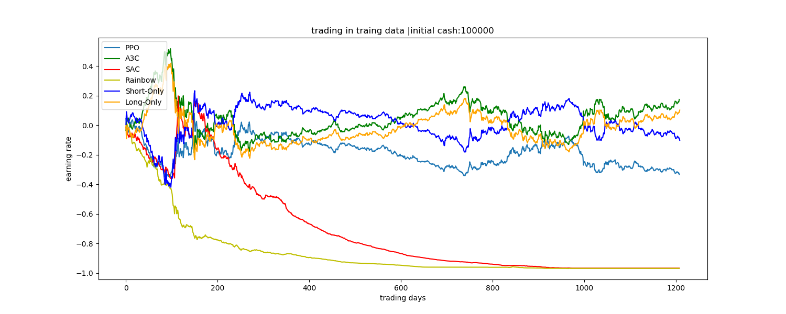

- 验证集回测

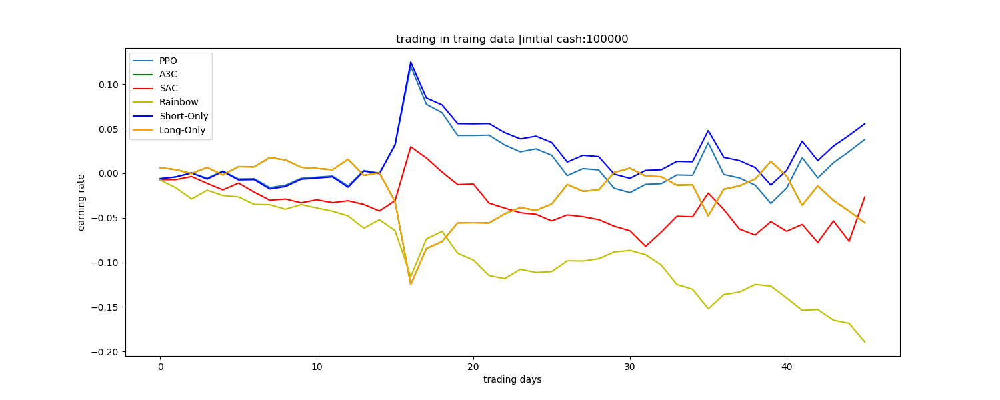

上图横坐标为交易的天数，纵坐标为earning rate，即收益率。共展示了四种策略（PPO，A3C，SAC，Rainbow）以及两个baselines（Long only和Short Only）

- 总结与下一版本计划

看到在当前版本，没有学到一个能够表现比baseline好的策略，最好学到了与baseline策略相当的策略。

下一步版本加入更多的feature，看是否feature多了之后能够学到更好的策略。

## version 2（0717）

网络结构与环境设置与version 1保持一致，state不再使用前五十分钟的价差，而是手动提取了14种不同的金融特征。

- state：2014年一篇文章中的分析的14个交易信号，长短期MA的交界处产生信号变动，短期天数为{1, 2, 3}，长期天数为{9, 12}，两个集合的笛卡尔积有6个元素。

  - MA(1, 9)，MA(2, 9)，MA(3, 9)，MA(1, 12)，MA(2, 12)，MA(3, 12)
  - MOMENTUM(9)，MOMENTUM(12)
  - OBV(1, 9)，OBV(2, 9)，OBV(3, 9)，OBV(1, 12)，OBV(2, 12)，OBV(3, 12)

- reward包括version 1的total profit，以及

  - log return：做出动作后并得到交易后，agent与上个时刻相比的收益情况，使用对数收益率，以满足reward可线性相加。
  - running sharp ratio：增量式更新的sharpe ratio，便于计算及网络参数更新。

  结果表明，使用这3种reward的差别不大，曲线基本相似。

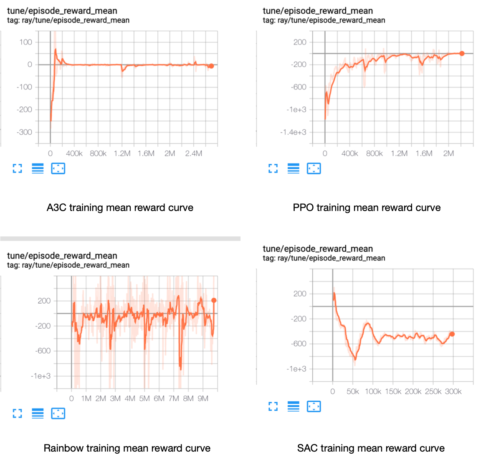

- 训练集回测

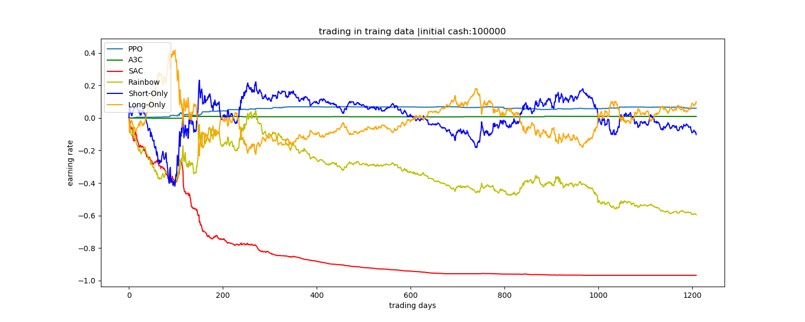

- 测试集回测

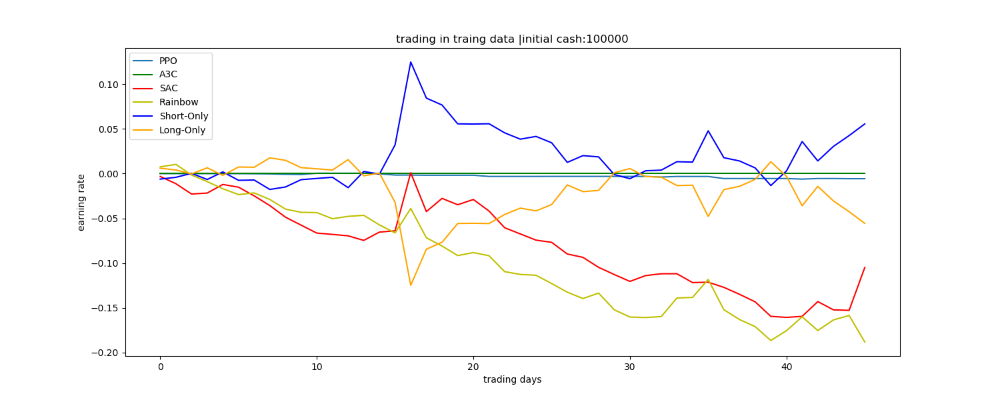

## version 3（0717）

网络结构与环境设置与version 2一致，只是在verison2的基础上在state里加入了持仓的情况

- 训练情况

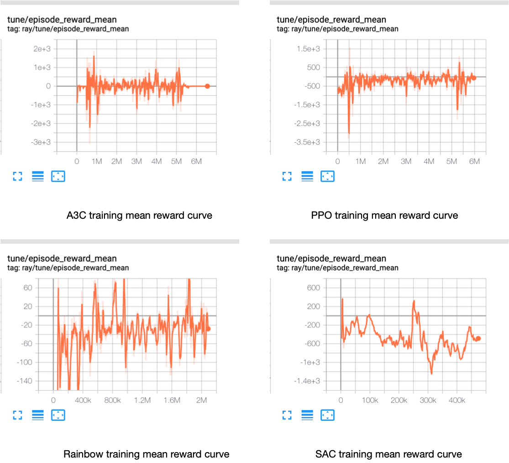

- 训练集回测

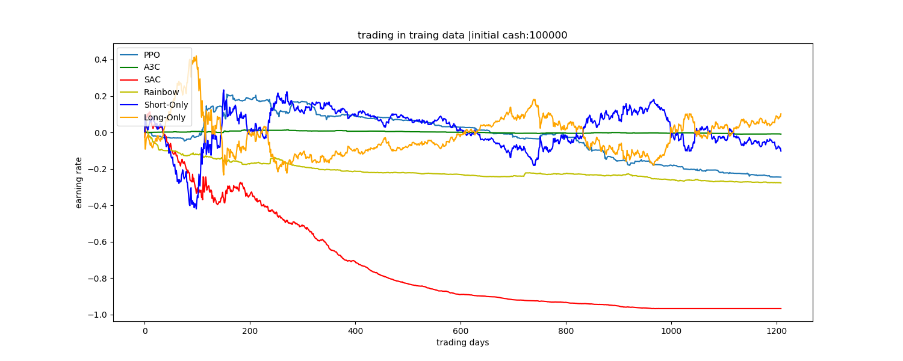

- 测试集回测

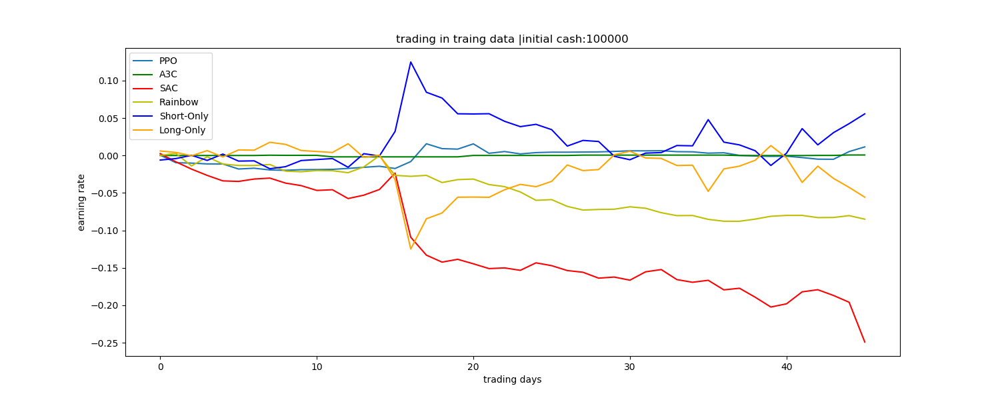

- 总结与下一版本计划

可以看到version 2和version 3的表现基本差不多，在训练过程中都表现不稳定，都没有训练获得表现突出的策略。其中，PPO和SAC趋近于不做动作，而Rainbow和SAC就是没有学到策略，回撤很大。

下一步打算统一各个模型的网络结构，都采用CNN尝试是否有所改善。

## version 4 （07.20）

- 网络结构，APX模型的网络用的全连接网络（3X256，激活函数为relu）
- 环境设置，reward用的total profit，state为前50分钟的价差，训练集为2015-01-01到2017-12-31代码为IF9999.CCFX的股指期货
  - state：前50分钟的价格取log后做差
  - total profit：做出动作并得到交易后，agent的资产与上一时刻的差值，Deng的文章中曾使用的reward。
- 训练情况

首先，我们在一年的数据（2015.01.01~2015.12.31）上进行训练，平均的reward一直在波动上升的趋势

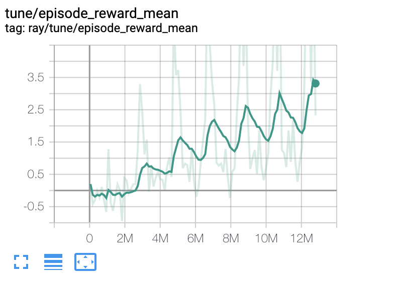

之后，我们又在三年的数据（2015.01.01~2017.12.31）上进行训练，可以看到平均的reward也是处在上升趋势

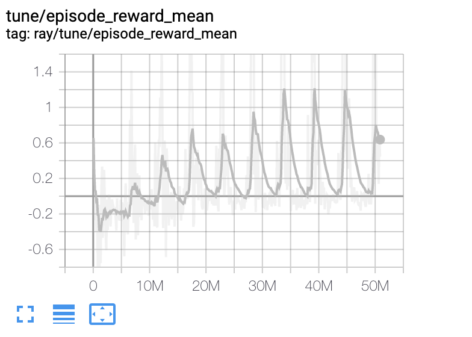

- 训练集回测

一年的训练数据的回测结果

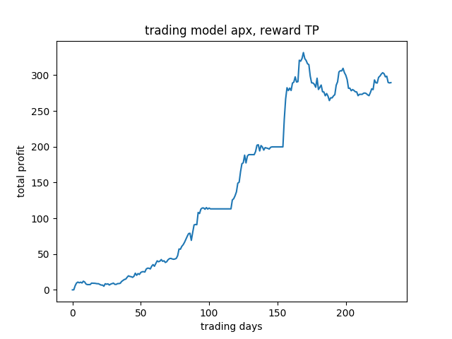

三年的训练数据的回测结果

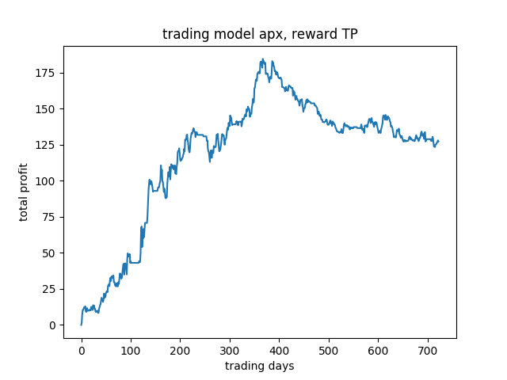

横坐标为交易的天数，纵坐标为收益率乘以100%

## version 5 （07.22）

- 网络结构，IMPALA模型的网络用的全连接网络（2X512，激活函数为relu）

- 环境设置，reward用的total profit 的收益率乘以百分之百。

  训练集为2015-01-01到2017-12-31三年代码为IF9999.CCFX的分钟级别的股指期货

  - state：state为维度：(n, 17)：前n分钟的log价差，14维的交易信号，agent的当前持仓状态和平仓后的收益率。
  - total profit：做出动作并得到交易后，agent的资产与上一时刻的差值，Deng的文章中曾使用的reward。

- 训练情况

用ray在一个GPU和30个CPU上训练了200M的steps，训练过程如下

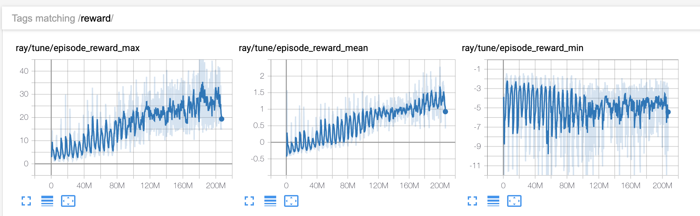

可以看到，随着训练的进行，mean reward一直在上升趋势，说明算法一直在更新，且取得了比较好的效果

- 在训练数据上回测

我们在三年的数据上进行回测，并与Short Only和Long Only对比。横坐标为交易的天数，共为三年的交易日。纵坐标为收益率乘以100%，初始资金为100000。

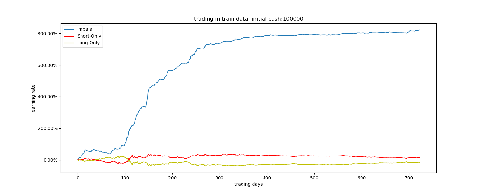

- 总结与下一版本计划

可以看到IMPALA模型能够在训练集学到很强的策略，接下来打算在更多的数据上进行训练，并在验证集上验证其扩展性。