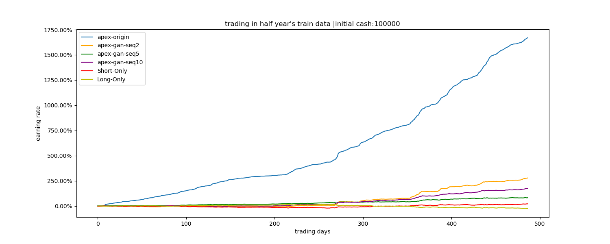

# RLMethods-Trading 记录

## version 1 （0715）

- 网络结构，PPO和A3C用的是LSTM（一层256层的全连接网络+256隐层的LSTM网络），Rainbow和SAC的网络用的全连接网络（Ray 默认的2X256，激活函数为relu）
- 环境设置，reward用的total profit，state为前50分钟的价差，训练集为2015-01-01到2019-12-31，验证集为2020-01-01到2020-05-31的代码为IF9999.CCFX的股指期货
  - state：前50分钟的价格取log后做差
  - total profit：做出动作并得到交易后，agent的资产与上一时刻的差值，Deng的文章中曾使用的reward。
- 训练集回测

- 验证集回测

上图横坐标为交易的天数，纵坐标为earning rate，即收益率。共展示了四种策略（PPO，A3C，SAC，Rainbow）以及两个baselines（Long only和Short Only）

- 总结与下一版本计划

看到在当前版本，没有学到一个能够表现比baseline好的策略，最好学到了与baseline策略相当的策略。

下一步版本加入更多的feature，看是否feature多了之后能够学到更好的策略。

## version 2（0717）

网络结构与环境设置与version 1保持一致，state不再使用前五十分钟的价差，而是手动提取了14种不同的金融特征。

- state：2014年一篇文章中的分析的14个交易信号，长短期MA的交界处产生信号变动，短期天数为{1, 2, 3}，长期天数为{9, 12}，两个集合的笛卡尔积有6个元素。

  - MA(1, 9)，MA(2, 9)，MA(3, 9)，MA(1, 12)，MA(2, 12)，MA(3, 12)
  - MOMENTUM(9)，MOMENTUM(12)
  - OBV(1, 9)，OBV(2, 9)，OBV(3, 9)，OBV(1, 12)，OBV(2, 12)，OBV(3, 12)

- reward包括version 1的total profit，以及

  - log return：做出动作后并得到交易后，agent与上个时刻相比的收益情况，使用对数收益率，以满足reward可线性相加。
  - running sharp ratio：增量式更新的sharpe ratio，便于计算及网络参数更新。

  结果表明，使用这3种reward的差别不大，曲线基本相似。

- 训练集回测

- 测试集回测

## version 3（0717）

网络结构与环境设置与version 2一致，只是在verison2的基础上在state里加入了持仓的情况

- 训练情况

- 训练集回测

- 测试集回测

- 总结与下一版本计划

可以看到version 2和version 3的表现基本差不多，在训练过程中都表现不稳定，都没有训练获得表现突出的策略。其中，PPO和SAC趋近于不做动作，而Rainbow和SAC就是没有学到策略，回撤很大。

下一步打算统一各个模型的网络结构，都采用CNN尝试是否有所改善。

## version 4 （07.20）

- 网络结构，APX模型的网络用的全连接网络（3X256，激活函数为relu）
- 环境设置，reward用的total profit，state为前50分钟的价差，训练集为2015-01-01到2017-12-31代码为IF9999.CCFX的股指期货
  - state：前50分钟的价格取log后做差
  - total profit：做出动作并得到交易后，agent的资产与上一时刻的差值，Deng的文章中曾使用的reward。
- 训练情况

首先，我们在一年的数据（2015.01.01~2015.12.31）上进行训练，平均的reward一直在波动上升的趋势

之后，我们又在三年的数据（2015.01.01~2017.12.31）上进行训练，可以看到平均的reward也是处在上升趋势

- 训练集回测

一年的训练数据的回测结果

三年的训练数据的回测结果

横坐标为交易的天数，纵坐标为收益率乘以100%

## version 5 （07.22）

- 网络结构，IMPALA模型的网络用的全连接网络（2X512，激活函数为relu）

- 环境设置，reward用的total profit 的收益率乘以百分之百。

  训练集为2015-01-01到2017-12-31三年代码为IF9999.CCFX的分钟级别的股指期货

  - state：state为维度：(n, 17)：前n分钟的log价差，14维的交易信号，agent的当前持仓状态和平仓后的收益率。
  - total profit：做出动作并得到交易后，agent的资产与上一时刻的差值，Deng的文章中曾使用的reward。

- 训练情况

用ray在一个GPU和30个CPU上训练了200M的steps，训练过程如下

可以看到，随着训练的进行，mean reward一直在上升趋势，说明算法一直在更新，且取得了比较好的效果

- 在训练数据上回测

我们在三年的数据上进行回测，并与Short Only和Long Only对比。横坐标为交易的天数，共为三年的交易日。纵坐标为收益率乘以100%，初始资金为100000。

- 总结与下一版本计划

可以看到IMPALA模型能够在训练集学到很强的策略，接下来打算在更多的数据上进行训练，并在验证集上验证其扩展性。

## version 6 （0723）

在版本5的基础上在5年（2015-01-01到2019-12-3）的期货数据上进行训练，设置与版本5一样。

- 训练情况

上图为训练5.5h的160M steps的训练轨迹，算法在不断优化，reward_mean随着训练的进行在不断的提升中

- 在训练数据上回测

我们在五年的数据上进行回测，并与Long Only和Short Only策略进行了对比

​			（横坐标为交易天数，五年共1200多天的交易日，纵坐标为收益率乘以100%）

从上图可以看到，在训练数据上五年能够翻五倍的收益，且没有较大的回撤。

- 在测试数据上回测

我们在测试数据（2020.01.01~2020.05.31）上用当前的模型进行回测，并与Long Only和Short Only策略进行了对比

虽然，训练数据上的回测效果已经很好，但是在测试验证数据上还是效果不佳，需要进一步优化

- 总结与下一步计划

从上述结果可以看到当前的IMPALA模型能够在训练数据上获得很好的训练效果但是扩展性不好，需要在接下来的工作中继续探索解决方案

下一步会继续探索更多的模型，并尝试Conv1D网络代替全连接网络。

## version 7（0725）

- 网络结构，IMPALA模型的网络用的Conv1D网络（Conv1D(128, kernel=5)->Dropout(0.5)->Conv1d(128, kernel=5)->fully_connect(512)，激活函数为relu）

- 环境设置，reward用的total profit 的收益率乘以百分之百。

  训练集为2015-01-01到2015-12-31一年的年代码为IF9999.CCFX的分钟级别的股指期货

  - state：state为维度：(n, 17)：前n分钟的log价差，14维的交易信号，agent的当前持仓状态和平仓后的收益率。
  - total profit：做出动作并得到交易后，agent的资产与上一时刻的差值，Deng的文章中曾使用的reward。

- 训练情况

用ray在一个GPU和30个CPU上训练了60M的steps，训练过程如下，可以看到随着训练的进行可以在一年的数据持续进行更新

说明，开发的CNN模型比较有效

- 训练数据的回测结果

如下图，所示，与训练的轨迹一样，当前模型在回测数据上，基本上一直处在上升趋势，而且基本不存在较大的回撤现象。

- 总结与下一步计划

自己构建的Conv1D模型能够在一年的数据上训练出比较好的结果，表示当前的model是有效的。

由于IMPALA模型支持LSTM网络，因此接下来的计划，打算分别用LSTM，全连接以及Conv1D网络结构在五年数据上进行训练，并比较在不同的网络结构下，在IMPALA模型上训练的效果。

## version 8 （07.28）

本版本，在五年的训练课数据上在IMPALA模型上分布用LSTM网络，全连接和Conv1d网络进行训练，并进行对比

- 网络结构定义如下

  - Conv1D网络（Conv1D(128, kernel=5)->Dropout(0.5)->Conv1d(128, kernel=5)->fully_connected(512)，激活函数为relu）
  - LSTM网络，fully_connected(512)->LSTM(512)
  - 全连接网络，fully_connected(512)->fully_connected(512)

- 环境设置，reward用的total profit 的收益率乘以百分之百。

  训练集为2015-01-01到2019-12-31一年的年代码为IF9999.CCFX的分钟级别的股指期货

  - state：state为维度：(n, 17)：前n分钟的log价差，14维的交易信号，agent的当前持仓状态和平仓后的收益率。
  - total profit：做出动作并得到交易后，agent的资产与上一时刻的差值，Deng的文章中曾使用的reward。

- 训练情况

  三种网络均可以在训练数据上训练得到好的结果

  - FC网络训练reward曲线

  

  - LSTM网络训练的reward曲线

  

  - Conv1D网络训练的reward曲线

  

- 训练数据的回测结果

坐标定义与上面版本定义一致。可以看到在训练数据上，Conv1D网络表现明显优于其他两个。

- 验证数据上回测结果

从下图回测的结果，三者的回测结果都不理想，表现与在训练中正好相反。

- 总结与下一步计划

Conv1D网络能够在训练数据上取得比其他网络更好的训练结果。但是在验证数据上的回测都表现不好。

用Conv1D网络在其他的模型中进行训练，看能否在训练数据取得好的结果。

## version 9 （08-09）

本版本，在APEX模型上分别用原始数据和GAN生成的数据训练策略模型，并进行对比

- 网络结构定义如下

  - Conv1D网络（Conv1D(128, kernel=5)->Dropout(0.5)->Conv1d(128, kernel=5)->fully_connected(512)，激活函数为relu）

- 环境设置，reward用的total profit 的收益率乘以百分之百。

  训练集为2017-01-01到2018-12-31两年，测试集为2019-01-01到2019-12-31一年的代码为IF9999.CCFX的分钟级别的股指期货。

  - state：state为维度：(n, 17)：前n分钟的log价差，14维的交易信号，agent的当前持仓状态和平仓后的收益率。
  - earning rate：做出动作并得到交易后，agent的资产与上一时刻的差值，Deng的文章中曾使用的reward 除以初始资金乘以100%。
  - gan生成数据策略，本次GAN模型训练的是能够生成与训练数据的分钟之间的差值具有相同分布的数据，gan-seq2表示，每次用GAN模型生成了2分钟长度的差值数据；gan-seq5，则表示生成5分钟长度的差值数据，gan-seq10，则表示生成10分钟长度的差值数据。这些GAN生成数据通过真实数据拼接而成。

- 训练数据的回测结果

- 验证数据上回测结果

- 结果分析和总结

从训练数据的回测结果来看，原始的数据训练的结果取得了很明显的优势，说明模型已经过拟合当前数据，而其他用GAN生成数据而训练的结果基本上都是处在上升趋势中，结果也不如原始数据获得的结果那么高。

用GAN数据训练得到的模型，seq5的结果要弱于seq10和seq2

从测试数据上回测结果来看，训练的模型仍然不能在未见过的数据获得较好的结果，虽然在seq5的结果稍微好些，但是也具有不稳定的特定。